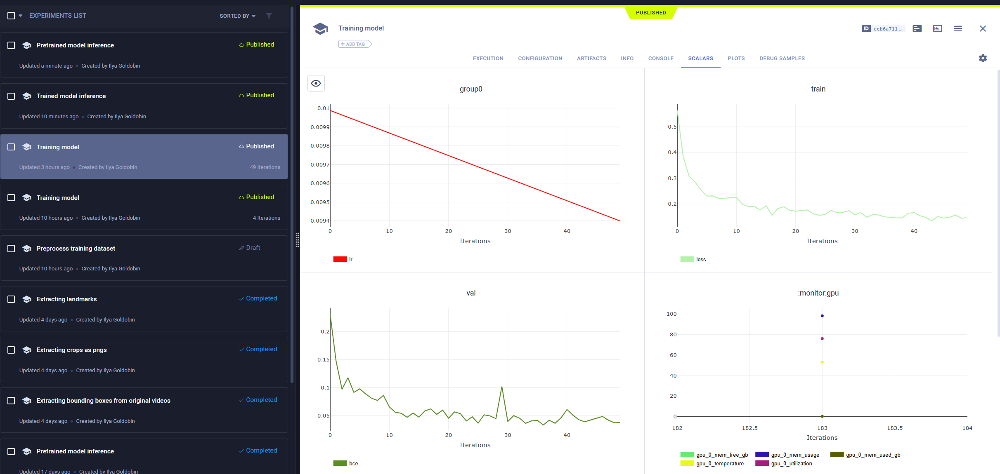
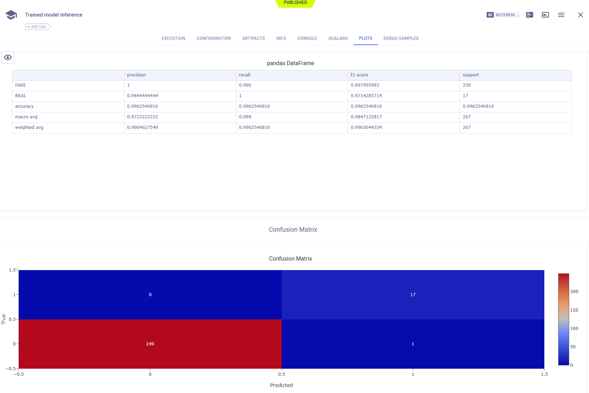
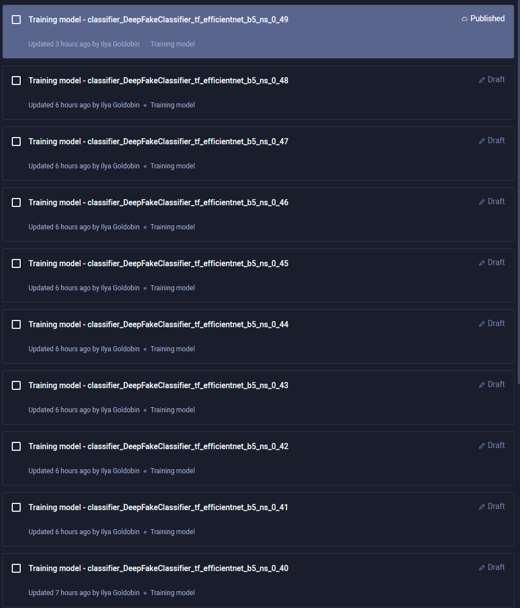
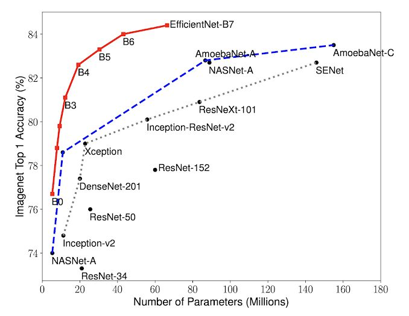
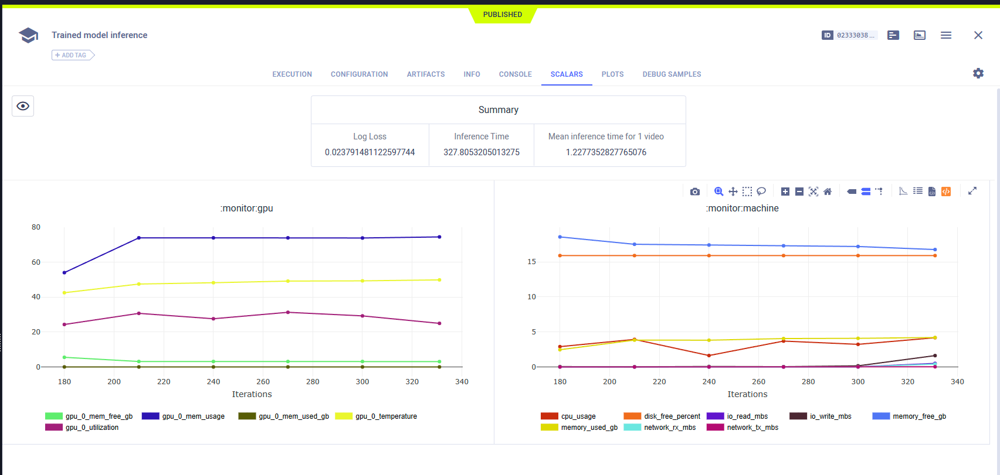

# Проект по созданию сервиса обнаружения дипфейков на видео

## Проектирование

Суть проекта в том, чтобы определять использование deepfake в загруженном пользователем видео

Данный сервис может быть использован для анализа видеозаписей в социальных сетях, чтобы предотвратить введение пользователей в заблуждение путем уведомления о наличии deepfake в видео

### Ограничения

- Время обработки видео должно составлять не более чем половину его длительности 

### Возможность масштабирования

- Объединение с видеохостингом (н-р: vk видео), внедрение сервиса в экосистему видеохостинга
- Реализация сервиса по подписке для некрупных СМИ, т. к. в скором времени дипфейки будут регулироваться законом
  [Источник 1](https://tass.ru/obschestvo/18100343) [Источник 2](https://ria.ru/20230328/deepfake-1861163762.html)

### Бизнес метрики

- Среднее время проведенное на странице сервиса
- Конверсия из первого использования во второе использование
- Количество использований сервиса за сутки

### ML метрики

- Recall, Accuracy, Precision, LogLoss

## Работа с данными

### Требования к данным

- Формат: директория с файлами формата .mp4 и файлом metadata.json, следующего вида:
  ```
  {"filename1.mp4": {"label": "FAKE/REAL"}
   ...
   "filenameN.mp4": {"label": "FAKE/REAL"}}
  ```
- Необходимый объем: 1300 видеозаписей длительностью от 5 до 15 секунд

### Инструкция для разметчиков

1. Найдите 650 видеозаписей, на которых различимы лица людей
2. Сгенерируйте, используя данные видеозаписи, 650 дипфейк видеозаписей
3. Создайте файл metadata.json в соответствие с требованиями
4. Разместите все видеозаписи и файл matedata.json в единой директории

### Расчет стоимости датасета

1300 * (1 / 12) * (23500 / 168) = 15154 рубля

- 1300 - количество видеозаписей
- 1 / 12 - 5 минут на обработку одной видеозаписи
- 23500 - МРОТ в СПб
- 168 - количество рабочих часов в месяц при 8-часовом рабочем дне

### Версионирование

Инициализирована начальная версия (0.1) датасета при помощи ClearML

## Обучение моделей

### Выбор моделей

В проекте используются две модели:

  - MTCNN для обнаружения лиц - выбран, т. к. есть простая в использовании реализация на PyTorch
    
  - Efficient Net для классификации deepfake лиц

### Эксперименты

Эксперименты залогированы при помощи ClearML И воспроизводимы







### Сравнение моделей


 
### Подбор гиперпараметров

Не пришлось подбирать гиперпараметры, с первой попытки удалось получить хорошие метрики на тестовой выборке




### ML метрики

- Accuracy
- Fake Recall

Данные метрики выбраны, т. к. они хорошо интерпретируемые и понятные

## MVP

### Сервис

Разработан сервис с импользованием Streamlit и FastAPI

### Окружение

Окружение зафиксировано с помощью Dockerfile и docker-compose файлов

### Запуск

1. `cd src`
2. для подключения к s3 положить в директории `client` и `server` файл .env следующего вида
   ```
   SERVICE_ACCOUNT_KEY_ID={ваше значение}
   SERVICE_ACCOUNT_SECRET={ваше значение}
   ```
3. в директорию `server/model/weights` положить веса модели
4. `docker compose up -d`
5. сервис доступен по адресу `http://localhost:8501/`

## Демо

[Запись демо](https://drive.google.com/file/d/1Eu9758dRQjrwLC9xjYcFQtotSauwxVcH/view?usp=sharing)
